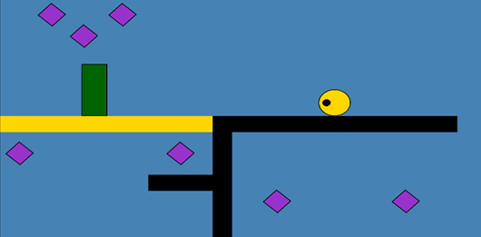

# Geometry Friends AI Competition @ IJCAI-ECAI 22

This is the Geometry Friends Game AI Competition repository that will be used at the IJCAI-ECAI 2022 conference, in particular, for visitors interested in knowing more about the submission process, as well as on-going work related to the competition. It also includes a compilation of all public levels of this year's competitions and previous implementations of agents for the game. Visitors will be able to play these levels with PC controllers.

The goal of the competition is to build AI agents for a 2 player collaborative physics-based puzzle platformer game (Geometry Friends). Each agent controls a different character (circle or rectangle) with distinct characteristics. Their goal is to collaborate in order to collect all diamonds in a set of levels as fast as possible. The competition raises interesting problems for AI agents. For example, to successfully solve a GF level the AI players need to: (1) deal with coordination at different layers: from motion control (e.g. achieving perfect timing) to level resolution (e.g. devising shared plans); deal with limited actuation situated in a simulated physics environment (with gravity and friction); (3) solve platform (skill) based puzzles, which involves discovering the proper order to collect the diamonds and identifying the points where collaboration is needed; and (4) do all the above in real-time.

  

## How to run the game and the agents:
  * Clone repository
  * Open folder <i>IJCAI-ECAI-GF-AI\GeometryFriendsGame\Release</i>
  * Run <i>GeometryFriends.exe</i>
  * Play Geometry Friends - Single Player, Multiplayer or Only Agents (Warning: change security properties of agents in the <i>Agents</i> folder for them to run)

If you want to play with controllers, you just need to connect them to your computer. In this repository, you can find a set of public levels of 2019 and 2022 competitions.

